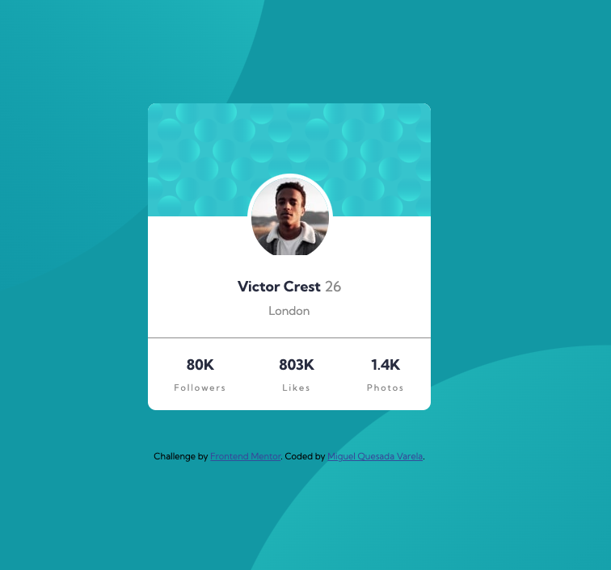

# Frontend Mentor - Profile card component solution

This is a solution to the [Profile card component challenge on Frontend Mentor](https://www.frontendmentor.io/challenges/profile-card-component-cfArpWshJ). Frontend Mentor challenges help you improve your coding skills by building realistic projects.

## Table of contents

-   [Overview](#overview)
    -   [The challenge](#the-challenge)
    -   [Screenshot](#screenshot)
    -   [Links](#links)
-   [My process](#my-process)

    -   [Built with](#built-with)

-   [Author](#author)

## Overview

### The challenge

Users should be able to:

-   View the optimal layout for the site depending on their device's screen size

### Screenshot

### Links

-   Solution URL: [Profile Card](https://github.com/jmiguelqv/profile_card_component)
-   Live Site URL: [Profile Card](https://jmiguelqv.github.io/profile_card_component/)

## My process

### Built with

-   Semantic HTML5 markup
-   CSS custom properties
-   Mobile-first workflow
-   Flex

## Author

-   Frontend Mentor - [jmiguelqv](https://www.frontendmentor.io/profile/jmiguelqv)
-   LinkedIn - [jose miguel quesada varela](https://www.linkedin.com/in/jose-miguel-quesada-varela/)
-   Github - [jmiguelqv](https://github.com/jmiguelqv)
